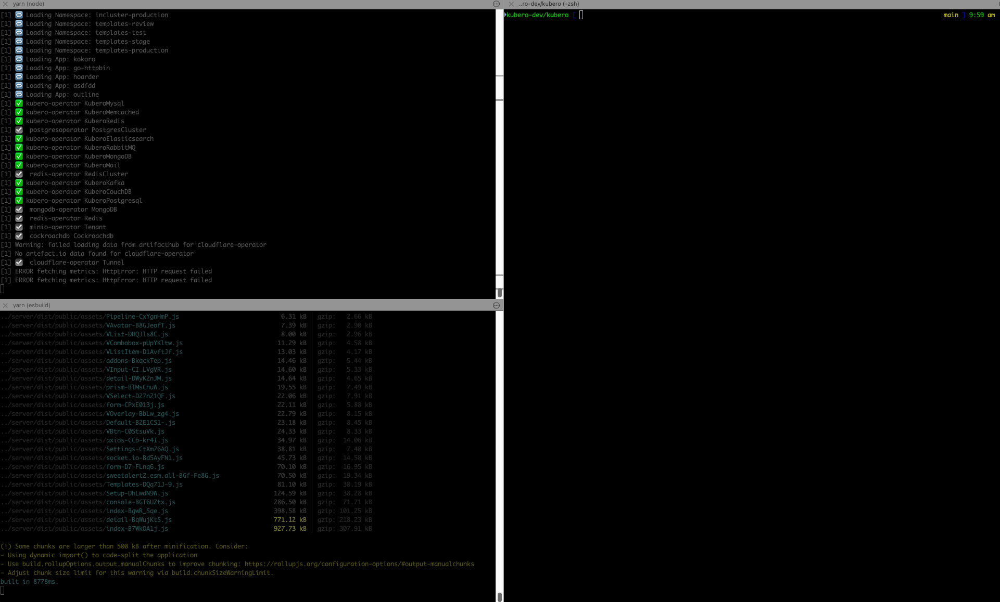

# Local development

## Prerequisites
- A running Kubernetes cluster. This can be a local cluster like [kind](https://kind.sigs.k8s.io/) or a remote cluster like [GKE](https://cloud.google.com/kubernetes-engine).
- [Node.js](https://nodejs.org/en/) and [Yarn](https://yarnpkg.com/) installed on your local machine.
- Fully install kubero on your cluster by running ```kubero install```


## Create a Fork
Fork the repository to your own GitHub account.

## Clone the repository
```bash
git clone git@github.com:your-github-account/kubero.git
```

## Export your kubernetes config 
In case you are using a local cluster like kind, you can export the kubeconfig to the local directory.
```bash
kind get kubeconfig --name kubero-001 > ./kubeconfig
```
Make sure the context in your kubeconfig the same as in the .env file KUBERO_CONTEXT

## Start the UI Backend
Open the first terminal. Configure the local ENV values according your needs. Change to the server directory to start the server. 
```bash
cd server
cp .env.template .env
yarn dev
```

## Build the Client UI
Open a second terminal and change to the client directory. Install the dependencies and start the client.
```bash
cd client
yarn watch
```

## Access the UI
Open your browser and navigate to [http://localhost:3000](http://localhost:3000)

## Happy coding
This is how my terminal looks like after starting the server and the client.

