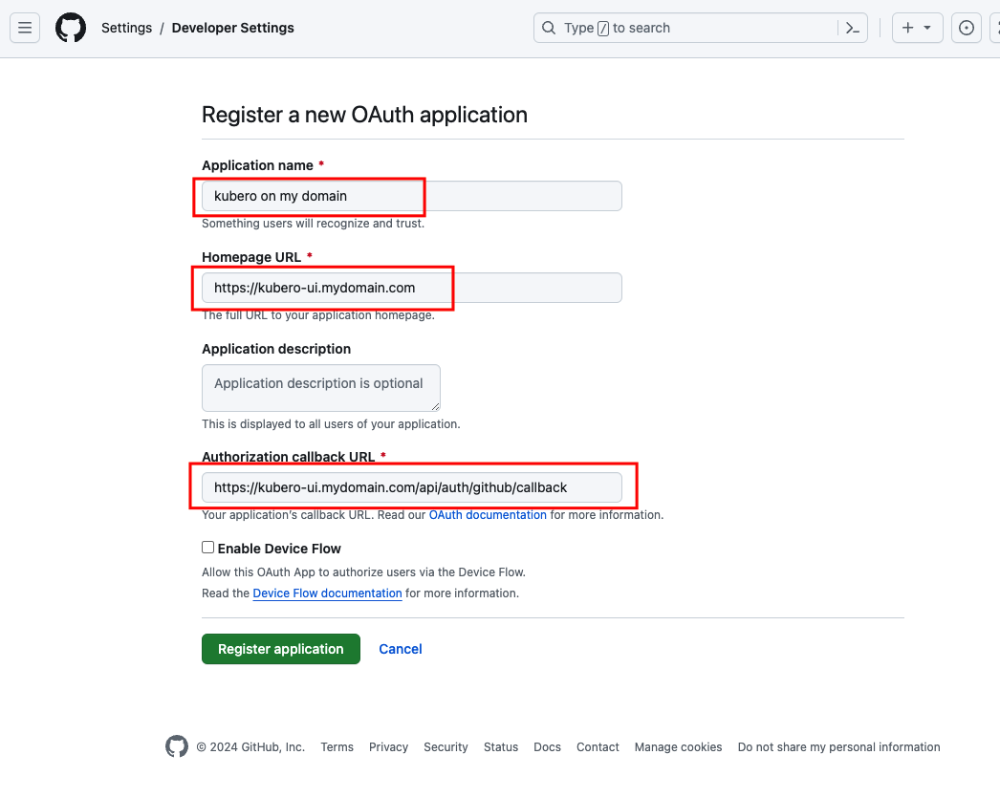
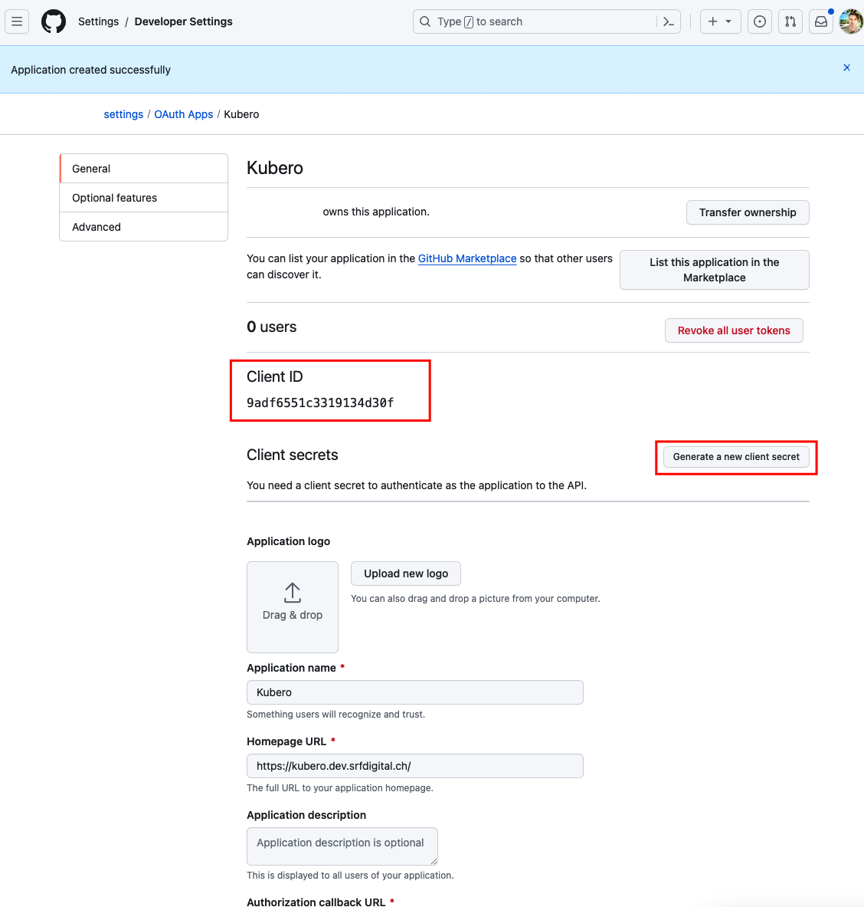

# Configuration

## Kubero UI

## Customize the Kubero configuration
Allways edit the `kuberoes` CRD to make changes in your Kubero configuration. Changes on the configmap will be overwritten by the operator. 

```bash
kubectl edit kuberoes kubero -n kubero
```


The config has three sections so far:

1. kubero: configures the UI
2. buildpacks: the selectable list of buildpacks
3. podSizeList: the selectable list of pods

A full example can be found here https://github.com/kubero-dev/kubero/blob/main/config.yaml

```yaml
kubero:
  readonly: false
  banner:
    show: false
    message: "Welcome to Kubero!"
    bgcolor: "#8560A9"
    fontcolor: "azure"
  auth:
    github:
      # set your secrets in the secret resource
      enabled: false
      id: ""
      callbackUrl: ""
      org: ""
    oauth2:
      enabled: false
      name: ""
      id: ""
      authUrl: ""
      tokenUrl: ""
      secret: ""
      callbackUrl: ""
      scope: "" # space seperated list of scopes
  auditLogs:
    enabled: false
    storageClassName:
    accessModes: 
      - ReadWriteOnce
    size: 0.1Gi
    limit: 1000
clusterissuer: letsencrypt-prod
templates:
  enabled: true
  catalogs:
  - name: "Kubero"
    description: "Kubero templates"
    templateBasePath: "https://raw.githubusercontent.com/kubero-dev/kubero/main/services/"
    index: 
      url: "https://raw.githubusercontent.com/kubero-dev/templates/main/index.json"
      format: "json" # json or yaml # TODO has no effect yet. json is always used
  - name: "Kubero Frameworks"
    description: "Kubero frameworks"
    templateBasePath: "https://raw.githubusercontent.com/kubero-dev/kubero/main/services/"
    index: 
      url: "https://raw.githubusercontent.com/kubero-dev/templates/main/index-frameworks.json"
      format: "json" # json or yaml # TODO has no effect yet. json is always used
buildpacks:
  - name: NodeJS             # displayed Name
    language: JavaScript     # Language detection match
    fetch:
      repository: ghcr.io/kubero-dev/buildpacks/fetch
      tag: main
    build:
      repository: node       # image to use
      tag: latest            # tag to use
      command: "npm install" # command to run
    run:
      repository: node
      tag: latest
      command: "node index.js"
podSizeList:
- name: small
  description: 'Small (CPU: 0.25, Memory: 0.5Gi)'
  default: true
  # resources are defined as usual in Kubernetes
  # https://kubernetes.io/docs/concepts/configuration/manage-resources-containers/
  resources:
    requests:
      memory: 0.5Gi
      cpu: 250m
    limits:
      memory: 1Gi
      cpu: 500m
```

## CD/CD Buildpipeline

Building docker images is a common task in the CI/CD pipeline. Kubero uses the buildpacks to build the images with Dockerfiles and Nicpacks.

These build images need to be pushed to a registry. The registry is configured in the `kubero` CRD. The registry requires a valid TLS certificate and a basic auth protection. 
It is possible use a public registry like `docker.io` or `ghcr.io` or to use the built-in registry.

https://docs.docker.com/reference/cli/dockerd/#insecure-registries for more information about insecure registries.

```yaml
registry:
  enabled: false  # creates registry credentials for a external or a local registry (required for build strategy apps)
  create: false   # spins up a local registry
  #host: registry.kubero.svc.cluster.local  # works for pushes, but not for pulls. DO NOT USE THIS :( since it requires to configure all nodes ot acceppt this "insecure" registry
  #host: docker.io                          # requires a docker account. Might be the best choice when running on a non public domain
  host: registry.demo.kubero.dev            # will make your images publicly avaialble with a basic auth protection
  account:
    # create account with:
    # docker run --entrypoint htpasswd httpd:2 -Bbn [username] [password]
    # http://aspirine.org/htpasswd_en.html (use bcrypt)
    username: kubero
    password: kubero
    hash: $2y$05$czQZpvtDYc5OzM/1r1pH0eAplT/okohh/mXoWl/Y65ZP/8/jnSWZq
  port: 443
  storage: 1Gi
  storageClassName:
```


## Authentication
The UI has a built-in authentication to restrict access. All methods can be used simultaneously.

### Local
This may fit for single users and very small teams. The authentication credentials are stored in the environment variable KUBERO_USERS as a base64 encoded string.

:::caution

Do not use this example credentials

:::

**1) create an encrypted password**
```
PASSWORD=asdf &&
SALT=asdf &&
echo -n $PASSWORD | openssl dgst -sha256 -hmac $SALT
```

**2) create a JSON file with the encrypted password. For example users.json**
```json
[
  {
    "id": 1,
    "method": "local",
    "username": "asdf",
    "password": "8a8423ba78c8f3da60a602493663c1cdc248a89541b12980e292399c0f0cad21",
    "insecure": false
    "apitoken": "asdf",
  },
  {
    "id": 2,
    "method": "local",
    "username": "qwer",
    "password": "qwer",
    "insecure": true,
    "apitoken": "asdf",
  }
]
```
**3) encode the created file to base64**
```
cat users.json | base64
```

**4) put the env var in your secrets.yaml and apply it**
```yaml
apiVersion: v1
kind: Secret
metadata:
  name: kubero-secrets
type: Opaque
data:
    ...
    ...
stringData:
    KUBERO_USERS: "WwogIHsKICAgICJpZCI6IDEsCiAgICAibWV0aG9kIjogImxvY2FsIiwKICAgICJ1c2VybmFtZSI6ICJhc2RmIiwKICAgICJwYXNzd29yZCI6ICI4YTg0MjNiYTc4YzhmM2RhNjBhNjAyNDkzNjYzYzFjZGMyNDhhODk1NDFiMTI5ODBlMjkyMzk5YzBmMGNhZDIxIiwKICAgICJpbnNlY3VyZSI6IGZhbHNlCiAgfSwKICB7CiAgICAiaWQiOiAyLAogICAgIm1ldGhvZCI6ICJsb2NhbCIsCiAgICAidXNlcm5hbWUiOiAicXdlciIsCiAgICAicGFzc3dvcmQiOiAicXdlciIsCiAgICAiaW5zZWN1cmUiOiB0cnVlCiAgfQpd"
    ...
    ...
```

```bash
kubectl apply -f secrets.yaml -n kubero
```

### Github
If you have already have a Github Organisation and want to grant access to them, use this section.

1. go to organisation settings -> developer settings -> OAuth Apps and register an application


2. Choos a name and a homepage URL. Set the callback url to `https://<your-kubero-domain>/api/auth/github/callback`


3. You will need the Client ID and the generated Client Secret


4. Configure the kubero UI
```yaml
kubero:
  auth:
    github:
      enabled: true
      id: "<your client id>"
      callbackUrl: "<your callback URL>"
      org: "your-org" # this will limit access to this organisation
```

:::info

The Organisation needs to be public and visible in user profile. Private Organisations are not supported by Github since they are not accessible during login process.

:::

5. Add the "Client Secret" to secret
```yaml
apiVersion: v1
kind: Secret
metadata:
  name: kubero-secrets
type: Opaque
stringData: 
  GITHUB_CLIENT_SECRET: <your client secret>
data:
    ...
    ...
```

### Oauth2 (gitea, azure, keycloak, ...)
This should fit all other usecases.
