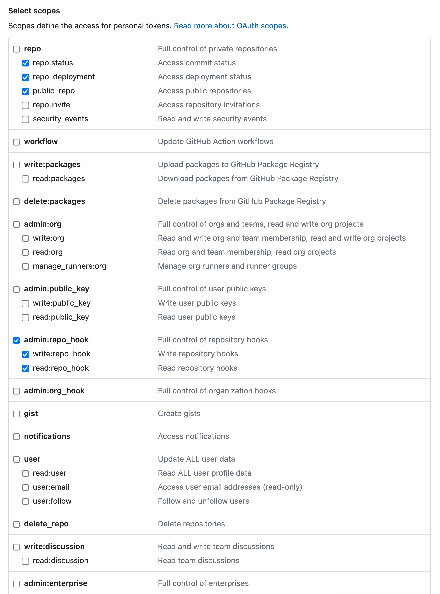
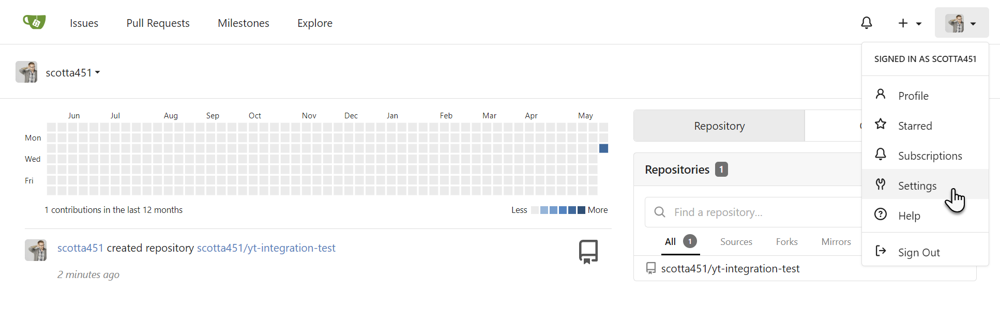

# Connect Repositories

To depploy your app by pullrequest or push you need to connect a repository to Kubero.
Therefor you need to create a Personal Access Token (PAT) on your repository provider.

List of available repositories

- GitHub
- Gitlab
- Bitbucket
- Gitea
- Gogs

## GitHub

Official documentation: [Managing your personal access tokens](https://docs.github.com/en/authentication/keeping-your-account-and-data-secure/managing-your-personal-access-tokens)

Link to your developer settings: [Link](https://github.com/settings/apps)

GitHub offers two types of PATs: *"fine-grained (beta)"* and *"Tokens (classic)"*. Kubero works with both types.

### Tokens (classic)

### Fine-grained (beta)

## Gitea
1. Log into Gitea and click your avatar to open the user menu, then select Settings.

2. From the Settings menu, select Applications.

In the Generate New Token section, enter a name for the token, then click the Generate Token button.

