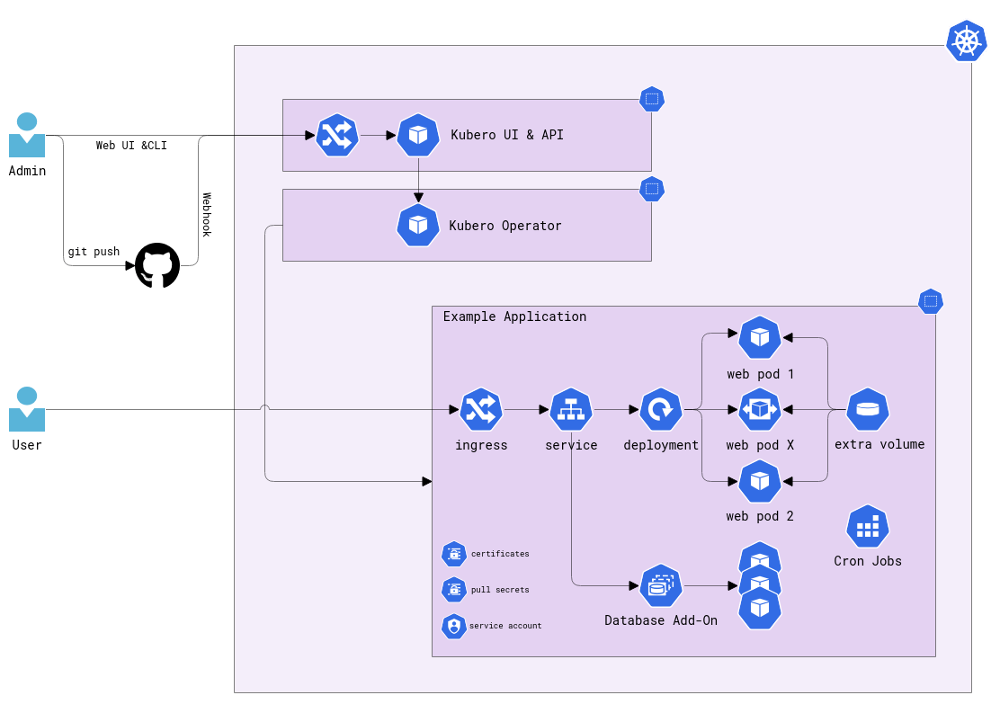

# Goals and Concept

Kubero provides a straightforward way to deploy 12-factor apps to Kubernetes without requiring developers to write 
Kubernetes manifests or Dockerfiles. It’s designed to simplify the deployment process, enabling developers to focus 
on building applications without worrying about the underlying infrastructure.

Kubero brings a Heroku-like experience to Kubernetes.

At its core, Kubero is a Kubernetes Operator with an intuitive UI, requiring only two containers:

- **Kubero Operator**
- **Kubero UI**

To manage your application, Kubero provides multiple options, including the Kubero UI, the Kubero CLI, or the Kubectl. All data is stored and persisted in the Kubernetes API, which ensures data consistency and reliability.

## Simple Application Deployment
Kubero uses a single Custom Resource Definition (CRD) to deploy applications. This CRD includes all the necessary information and add-ons to deploy an application.

## GitOps and CI/CD Process

Kubero’s integrated CI/CD pipeline enables developers to deploy applications quickly and easily. With a simple push 
to a branch, or by opening a pull request, you can deploy an app or even start a new instance based on the pull request.

### Runpacks
Unlike traditional methods, the runpacks does not build a container image. Instead, it pulls your code and runs the build 
scripts directly within a running container, significantly speeding up the process by eliminating the need to build, push, 
and pull images from a registry.

### Buildpacks, Nixpacks, and Dockerfiles
Kubero supports building images using buildpacks.io, Nixpacks, and Dockerfiles. Once built, these images must be pushed 
to a container registry.

### Pre-built Container Images
Additionally, Kubero offers the flexibility to deploy pre-built container images in your existing Build environment like Github, Jenkins. 

This allowing you to choose the approach 
that best fits your workflow and deployment needs.

## Integrations
You can run any application that can run in a container. Supported languages and frameworks include:

- **GoLang** (including Hugo, gin-gonic)
- **Python** (including Flask)
- **JavaScript/NodeJS**
- **PHP** (including Laravel)
- **Ruby** (including Rails)
- **Static HTML**
- **Rust** (including Rocket)
- **...**

Kubero's flexibility allows you to adapt the build environment to your application's specific requirements.

You find the preconfigured runpacks and examples here:
https://github.com/kubero-dev/runpacks

## Addons/Plugins
Addons are deployed with Kubernetes Operators which are configurable over the UI. Built-in Addons are shipped with the Kubero Operator. The other addons require a separate installation of the operator.

## Articles and Tutorials
 - [Kubero : alternative à Heroku pour Kubernetes](https://dev.to/deep75/kubero-alternative-a-heroku-pour-kubernetes--19am)
 - [Comparing selfhosted Heroku alternatives](https://dev.to/shoksuno/comparing-selfhosted-heroku-alternatives-249p)
 - [The simplest way to run your own Heroku on Kubernetes](https://dev.to/shoksuno/the-simplest-way-to-run-your-own-heroku-on-kubernetes-3l03)
 - [Replace Heroku with Kubero on Kubernetes (part 1)](https://dev.to/shoksuno/replace-heroku-with-kubero-on-kubernetes-2aoj)
 - [Kubero: A Powerful Heroku Alternative for Your Development Needs](https://medevel.com/kubero/)