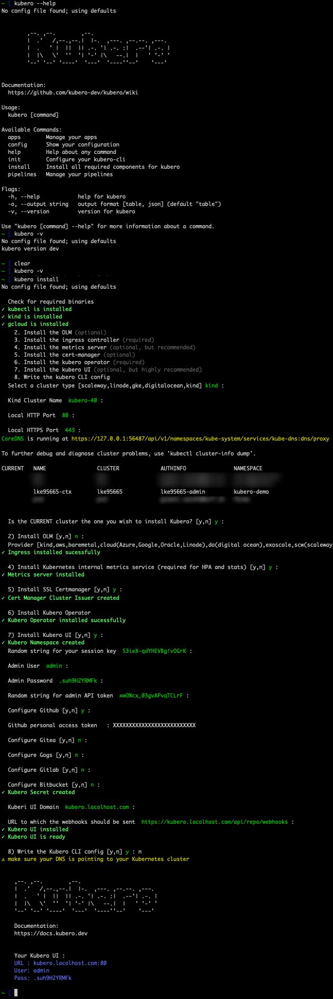

# Quickstart

The easiest way to install Kubero is to use the Kubero CLI. It will install all required components and configure everything for you. It is also possible to install every component separately.

Currently the CLI has integrations the following Kubernetes providers:
- scaleway
- linode
- gke
- digitalocean
- kind (local)

But it is possible to install Kubero on every Kubernetes cluster greater than 1.19. A specific installation guide for your Kubernetes distribution can be found [here](/Installation).

# Quickstart
1) Download and unpack the <a href="https://github.com/kubero-dev/kubero-cli/releases/latest">Kubero CLI</a> binary for your operating system


### Binaries (MacOS, Linux)
```bash
curl -fsSL get.kubero.dev | bash
```

### Brew (MacOS, Linux)
```bash
brew tap kubero-dev/kubero
brew install kubero-cli
```

2) Run the kubero install command and follow the instructions

```bash
kubero install
```




## Install/upgrade a single component

It is possible to install every component separately. with the "-c" flag. This is useful if you want to upgrade a single component.
```bash
kubero install -c kubero-operator
```

List of all available components:

- kubernetes
- olm
- ingress
- metrics
- certmanager
- kubero-operator
- kubero-ui
- all (default, runs all components in the best order)
